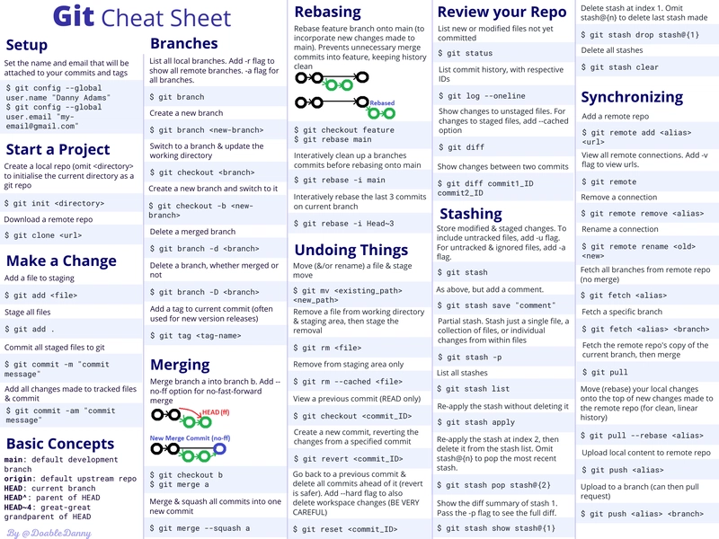

# PracticeMode404

JAVA Notes

Author Name : SIKANDER
Date : 14 Dec 2025
Reson for Code : Java Selenium Learning
What Code will do : Stong the Conecpt of Java Selenium Automation

JAVA
1991 -- Sun Microsystem,USA   / James Gosling

Purly Object Oriented Language

Source Code-----> Complied to ---> Byte Code ----> Interpreted ----> Machine Code

Class & Object
Inheritence
Polymorphisim
Abstruction
Encapculation

Platform Independent

Primitive Data type and Non Premitive Data type

byte --> Short -> int --> Long --> float --> double---> boolean   ||  char
Size    2 byte    4 byte   8 byte  4 byte      8byte

String[] args ---> JVM Standard to pass Arguments and It takes arguments as String
int[] args -- > x incorrect why of passing argument by commend line argument

String [] args -- ok
String args [] -- ok

Simple Language : User friendly Syntex
High Level Language : Plan text / User understandable code
Platform Independent: Once wrote the code then it can be executed on any plateform like machine/mac/linux/windows  (JVM of any plateform)
Interpreted ---> byte code is interpreted into machine code

Before creating any program, JDK must be properly installed in our system.
Write a Program on any IDE/Text Editor.
To compile the code, Java compiler (Javac) must run.
It will create a test.class file which contains byte code of the Program.
then we need Interpreter to run the code and JVM helps in that.

Every oprating system has different JVM.

JDK ---> JRE + JVM + Compiler + Java Docs + Java Debuggers

JRE ---> JVM + Applet + browser

JVM -- - > Virtual Machine + Garbage collector.

# Java Doesn't support muliple Inheritence but can be achieved by interfaces. 
# Java doesn't suppot Pointrt.

Java Variables : 

1. Local Variable
2. Instance Variable
3. Static Variable

Local Variable : Defined inside of a method/function
    # can only be used inside the method where it is defined.
    # Can not be defined with Static keyword. / Static keyword can not be used with Local variable.

Instance Vaiable : Declared outside the method and Inside a class.

Static Variable : Declared with static keyword. ( It can not be local variable.)
        #Memory allocation for static variable happens only once when the class is loaded in the memory.

        Int            x         =    6 ; 

        Data Type   Identifier       Literal

# Identifier ==> Name of variable/method/class/package/constant
# Literal ==> Values of Variable/constant

Reserved words : some words are reserved in java which can not be as identifier. (Static, Void, Final, Finally, Main etc)

Autoboxing : Convert primitive data type into their respective Wrapper classes.
            Reason : to perform operations on primitive data type

            int a = 5;
            Integer b = a;

Typecasting : Process of changing data type, Useful when we want to perform operation on different datatype or we want to store 
                value of one datatype into a different one.

                byte --> short --> int --> long --> float--> double --------------> Widening Type Casting // Implicit typecasting
                double --> float --> long --> int ---> short --> byte ------------> Narrowing Type Casting// Explicit typecasting

                double a = 15.9;
                int b = (int) a;

                int x = 14;
                double y = x;
     
# Java Control Statements :
    Java complier excute code from top to bottom and execute according to the order they appear.

    1. Decision Making Statement:
        A. If Statement: 

                If (X > 10){
                    System.out.print(x);
                }
        B. IF-else Statement:
                If (X >= 10){
                    System.out.print(x);
                }else{
                    System.out.print("Try again");
                }

        C. If-Else If Statement : 
                If (X > 10){
                    System.out.print("Value is greater than variable");
                }else if( X = 10 ){
                    System.out.print("Value is equals to variable");
                }else {
                    System.out.print("Value is less than variable");
                }
        D. Nested If-else :
                If (X > 18){
                    If(Gender =='Male'){
                        System.out.println("Ride a Bike");
                    }else{
                        System.out.println("Ride a Scooty");
                    }
                    System.out.print("Value is greater than variable");
                }else {
                    System.out.print("Not allowed to ride a Bike/Scooty");
                }

        E. Switch Statement : 
            Switch( day){
                case 1 :
                  System.out.println("Day 1 : Monday");  
                  break;
                case 2 :
                  System.out.println("Day 2 : Tuesday");  
                  break;
                case 3 :
                  System.out.println("Day 3 : Wednesday");  
                  break;
                case 4 :
                  System.out.println("Day 4 : Thursday");  
                  break;
                case 5 :
                  System.out.println("Day 5 : Friday");  
                  break;
                default:
                    System.out.println("Weekend or Off-day")
            }
    2. Loop Statement :
        A. do while loop :
            Useful if we want to execute condition irrespective of true/false then use do - while.
            do {
                System.out.println("Number : " + i );
                i ++;
            }
            while (i <= 10){
                System.out.println("Number : " + i );
            }

        B. While loop : (If we are not having number of iterations | We have termination condition)
            # factorial Program
            int factorial = 1; number = 5; temp_num = 0;
            temp_num = number;
            While(temp_num !=0){
                factorial = factorial * temp_num;
                -- temp_num ;
            }

        C. for loop :  ( Index based access of elements | We have a start point and End Point)
            for (int i = 0; i <=10; i++>){
                System.out.println("Number : " + i );
            }

        D. for each loop: ( Used to traverse Array or collection)
            Int[] arr = { 1,2,3,4,5,6};
            for (int a : arr){
                System.out.println("Number : " + a );
            }

    3. Jump Statement:
        A. break
            used to break the loop
            
        B. Continue
            used to skip one iteration
        
        C. return 

            public static int greater( int x; int y){
                if (x > y){
                    System.out.println("Greatest Number : " + x );
                }else{
                    System.out.println("Greatest Number : " + y );
                }
            }
        D. Exit 
            System.exit(0) --- Successful Termination
            System.exit(1) --- UnSuccessful Termination
            System.exit(-1) --- UnSuccessful Termination with exception

# Final Keyword : 
    1. Final Variable :
        After initialization, cannot be modified or updated
        final int x = 5;

        If Try to modify then compile-time error
        final int x = 10;
        x = 20;   // ❌ Compile-time error

    2. Final Method : 
        Cannot be overridden by its subclass
        final  void display(){
            System.out.println("hello world");
        }

        If try to override the final method
        class Parent {
            final void show() {
                System.out.println("Parent show()");
            }
        }

        class Child extends Parent {
            @Override
            void show() {   // ❌ Compile-time error
                System.out.println("Child show()");
            }
        }

    3. Final Class : 
        Cannot be extended or inherited
        but we can modify/change the object of that class

        final class A { 

        }

        class B extends A {   
            // ❌ Compile-time error
        }
        
        -- Can we modify/change the object of a final class
        final class Person {
            int age;
        }

        Person p = new Person();
        p.age = 30;   // ✅ Allowed

# This Keyword : 
    - The this keyword refers to the current object and is used to access instance variables and methods. It cannot be used in static context.

    public class this_class {  
        int a = 5;
        int b = 10;
        public void greater( int x, int y){
                if (x > y){
                    this.a = x;
                    this.b = y
                    System.out.println("Greatest Number : " + x );
                }else{
                    System.out.println("Greatest Number : " + y );
                }
            }
    }

    - The this keyword is used to invoke methods of the current object (instance), not the class.
    
    class Test {
        void show() {
            System.out.println("Show method");
        }

        void display() {
            this.show();   // ✅ refers to current object
        }
    }

    - Used to invoke constructors of the current class

    class Test {
        Test() {
            this(10);   // ✅ calls parameterized constructor
            System.out.println("Default constructor");
        }

        Test(int x) {
            System.out.println("Parameterized constructor: " + x);
        }
    }

# Class 
A class in Java is a blueprint or template for creating objects. It is a fundamental component of the object-oriented programming (OOP) model, defining the structure and behavior that all objects of that class will share. 
Static, Final, Abstract, Concrete and Singleton Class.

    1. Concrete Class : 
    A normal class with full implementation.

    class Car {
        void run() {
            System.out.println("Car is running");
        }
    }

    2. Abstract Class : 
    A class declared using abstract keyword.
    ✔ Can have abstract & concrete methods
    ❌ Cannot create object directly
    ✔ Supports inheritance

    abstract class Vehicle {
        abstract void move();
    }

    3. Static Class : 
    Java does NOT allow a top-level static class
    Only nested (inner) classes can be static
    A static class in Java is a static nested class—a class defined inside another class using the static keyword.

    class Outer {
        static class Inner {
            void show() {
                System.out.println("Static Inner Class");
            }
        }
    }

    4. Final Class : 
    A class declared using final keyword.
       
        final class Constants {
            }
    ❌ Cannot be inherited
    ✔ Used for security
    ✔ Example: String

    5. Singleton Class :
    In object-oriented programming, a singleton class is a class
    that can have only one object (an instance of the class) at a
    time.
    ✔ Used in logging, config, DB connection
    class Singleton {
        private static Singleton obj = new Singleton();
        private Singleton() {}
        public static Singleton getInstance() {
            return obj;
        }
    }

# Object :
    In Java, an object is an instance of a class.

    Example

    | Real World       | Java      |
    | ---------------- | --------- |
    | Car              | Class     |
    | Red Car          | Object    |
    | Speed, Color     | Variables |
    | Drive(), Brake() | Methods   |

    # New keyword:
    ClassName obj = new ClassName();

# Constructor :
    A constructor is a special method used to initialize objects in Java.
    Key Characteristics
        - Constructor name = Class name
        - No return type (not even void)
        - Automatically called when an object is created using new
        - Used to initialize instance variables
        - There can be multiple constructor in a class with different-different parameters and with same name.

        class Student {
            int id;
            String name;

            Student() {                        // Constructor Name Same as Class name
                System.out.println("Constructor called");
            }
        }

        Core Rule : 

        - The first statement inside a constructor must be either this() or super().
        this() → calls another constructor of the same class
        super() → calls parent class constructor
        - If you don’t write either, the compiler automatically inserts super() (no-argument).

        class Parent {
            Parent() {
                System.out.println("Parent constructor");
            }
        }

        class Child extends Parent {
            Child() {
                System.out.println("Child constructor");
            }
        }

        What compiler does internally : 

        class Child extends Parent {
            Child() {
                super(); // compiler adds this automatically
                System.out.println("Child constructor");
            }
        }

        ✔ Parent constructor is called first
        ✔ Then child constructo

    Parent has ONLY parameterized constructor : 

    class Parent {
        Parent(int x) {
            System.out.println("Parent constructor: " + x);
        }
    }

    class Child extends Parent {
        Child() {
            System.out.println("Child constructor");
        }
    }

    // constructor Parent() is undefined 
    // Compile-time error ( Compiler tries to insert super(), But no no-arg constructor exists )

    Correct Child class : 

    class Child extends Parent {
        Child() {
            super(10);     // must explicitly call parameterized constructor bcz no argument parameter can be added by java automatically but with argument we have to add
            System.out.println("Child constructor");
        }
    }

    Types of Constructors : 

    1. Default Constructor : 
        If We do not define any constructor, Java provides one.

    2. No-Argument  :
        A constructor with no parameters written by the programmer.

        class Employee {
            Employee() {
                System.out.println("No-arg constructor");
            }
        }

    3. Parameterized Constructor
        A constructor that accepts parameters.
        
        class Employee {
            int id;
            Employee(int id) {
                this.id = id;
            }
        }

# Methods : 

# Access Modifier : 
    Access modifiers control the visibility (scope) of:
        classes
        variables
        methods
        constructors
    They help enforce encapsulation and security in Java.

    Use of Access Modifiers : 
        ✔ Data hiding
        ✔ Controlled access
        ✔ Security
        ✔ Loose coupling
        ✔ Clean API design
    Without access modifiers, anyone can access everything, which is unsafe.

    Types of Access Modifiers in Java

    Java has 4 access modifiers:

        public
        protected
        default (package-private)
        private

    1. public :
        Accessible from anywhere.

        public class Test {
            public int x = 10;

            public void show() {
                System.out.println(x);
            }
        }

    2. Protected :
        Accessible:
            same package
            subclass (even in different package)

            class Parent {
                protected int x = 10;
            }

            class Child extends Parent {
                void display() {
                    System.out.println(x);
                }
            }

    3. default ( package-private) :
        Accessible only within the same package.
        ❌ Not accessible outside package

        class Demo {
            int x = 5; // default access
        }

    4. private :
        Accessible only inside the same class.
        ✔ Used for data hiding
        ✔ Access via getters/setters

        class Account {
            private double balance = 1000;

            public double getBalance() {
                return balance;
            }
        }

    Scenario 1: Can we override a method with weaker access? ---> No
        ✔ Access level must be same or higher

        class A {
            protected void show() {}
        }

        class B extends A {
            void show() {} // ❌ default is weaker than protected
        }

    Scenario 2: Can constructor be private ? --> Yes
        class Singleton {
            private Singleton() {}
        }

    Scenario 3: Default vs Protected (Very Confusing)
        default → same package only
        protected → same package + subclass outside package

    Scenario 4: Can private methods be overridden? --> No

    Scenario 5: Access modifier in interface ---> ✔ All interface members are public by default

    - Most restrictive → private
    - Least restrictive → public
    - protected is mainly used for inheritance
    - Top-level classes cannot be private or protected
    - You cannot reduce access level while overriding

# Map
Map is an interface in java.util used to store data in key–value pairs.
    - Keys are unique
    - Values can be duplicate
    - One key maps to one value
    - Map is NOT part of the Collection interface

    Example :
    Map<Integer, String> map = new HashMap<>();
    map.put(1, "Apple");
    map.put(2, "Banana");
    map.put(3, "Mango");

    System.out.println(map.get(2)); // Banana

Common Map Methods : 
    - put(k,v)	: Add key–value
    - get(k)	: Get value
    - remove(k) :	Delete entry
    - containsKey(k) :	Check key
    - containsValue(v) :	Check value
    - keySet() :	Get all keys
    - values() :	Get all values
    - entrySet() : Key–value pairs

        marks.put("Math", 85); // Updates value from 80 → 85
        marks.replace("Science", 78);   

        marks.put("English", marks.get("English") + 5);  //Increase value 
        marks.compute("Math", (k, v) -> v + 2);

        marks.put("Science", marks.get("Science") - 3);  // Decrease value
        marks.compute("Science", (k, v) -> v - 1);

    Hashmap Allows one null key and Allows multiple null values
    When to use Hashmap :
        - When order does NOT matter
        - When performance is important

    LinkedHashMap : 
        - Maintains insertion order
        - Internally uses HashMap + Doubly Linked List
        ✔ Maintains insertion order
        ✔ Allows one null key
        ✔ Slightly slower than HashMap
        
        Map<Integer, String> map = new LinkedHashMap<>();

        When to use LinkedHashMap :
            - When order matters
            - When predictable iteration is needed

    TreeMap : 
        Stores keys in sorted order
        Uses Red-Black Tree
        Sorting is natural or custom

        Map<Integer, String> map = new TreeMap<>();

        Key Points :
            ✔ Allows null values
            ✔ Sorted map
            ✔ Time complexity: O(log n)
            ❌ Does NOT allow null keys

        When to use?
            ✔ When sorted data is required
            ✔ When range queries are needed

    Comparison Table : 
        Feature	        HashMap	    LinkedHashMap	    TreeMap
        Order	        No	        Insertion	        Sorted
        Data Structure	Hash Table	Hash Table + DLL	Red-Black Tree
        Null Key	    ✔ One	    ✔ One	            ❌
        Null Values	       ✔	    ✔	                ✔
        Performance	    Fastest	    Medium	            Slowest
        Thread-safe	    ❌	        ❌	                ❌

    HashMap does not maintain order and offers O(1) performance, while TreeMap maintains sorted order with O(log n) complexity.
    Why TreeMap does not allow null key? -Because comparison is required for sorting, and null cannot be compared.
    Which Map maintains insertion order ? - LinkedHashMap
    Which Map is fastest? - HashMap

    Real-Life Example
        HashMap → User sessions
        LinkedHashMap → Recently viewed items
        TreeMap → Sorted reports, rankings

# Git Commands Cheatsheet
